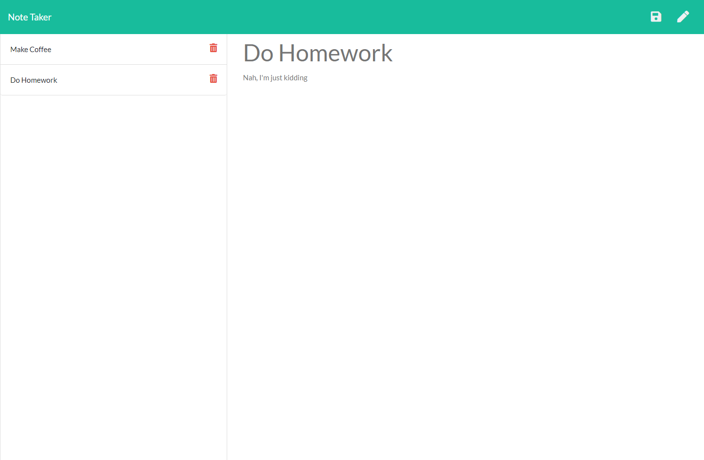

# Note-Taker
## 
## Table of Contents
- [Description](#Description)
- [Installation Instructions](#Installation-Instructions)
- [Usage Information](#Usage-Information)
- [Contribution Guidelines](#Contribution-Guidelines)
- [Test Instructions](#Test-Instructions)
- [Questions](#Questions)
## Description
This is a note taker. The user can input pieces of note with a title and body text, and the notes can be viewed via a sidebar as well as deleted individually.
## Installation Instructions
```
npm i
```
## Usage Information
Upon reaching the landing page, the user can click on the "Get Started" button to go to the notes page. When at the notes page, the user can type in the note title and note text, and the note will be saved when clicking the save icon at the top-right corner. Saved notes will be displayed in the sidebar on the left, and the user can view previously saved notes by clicking on the name. Should the user choose to delete a note, they can simply click on the trash can icon for the corresponding note.
## Sample Page

## Contribution Guidelines
N/A
## Test Instructions
```
N/A
```
## Questions
GitHub profile: github.com/runescape11111/

Email: olivershih@gmail.com
